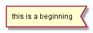
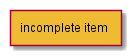

# IRLS Wiki

## Schema items

* start of request: 
* simple synchronous operation: 
* simple database/async operation: 
* complex operation:   
It's expected that you have detailed schema of the complex operation linked to the page!

* incomplete operation:   There might be no appropriate documentation yet for the item

## Files

[Client controllers](controllers.md)  
[Client dao](dao.md)  
