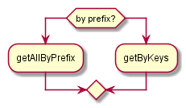
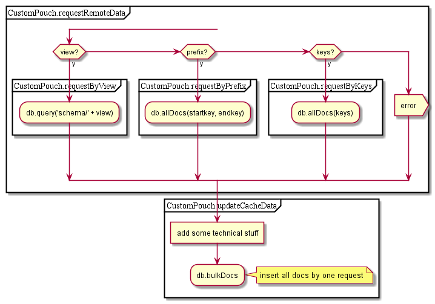
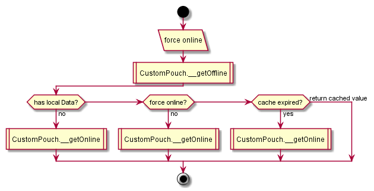

# AgentStorage

## Contents

* [byId](#byid)
* [byIds](#byids)
* [byPrefix](#byprefix)
* [onlineRequest](#onlinerequest)

## byId

See [onlineRequest](#onlinerequest)

  

## byIds

See [onlineRequest](#onlinerequest)

  

## byPrefix

See [onlineRequest](#onlinerequest)

  

## onlineRequest

This chapter describe logic of such methods as
[DB.query.byId](#byid)
[DB.query.byIds](#byids)
[DB.query.byPrefix](#byprefix)

Offline request:

Online request:

  
