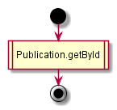
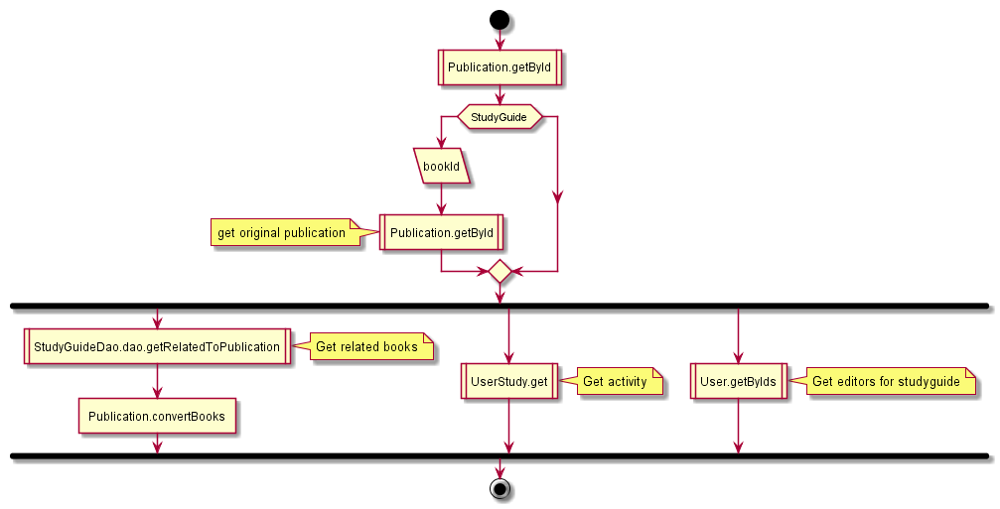
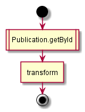
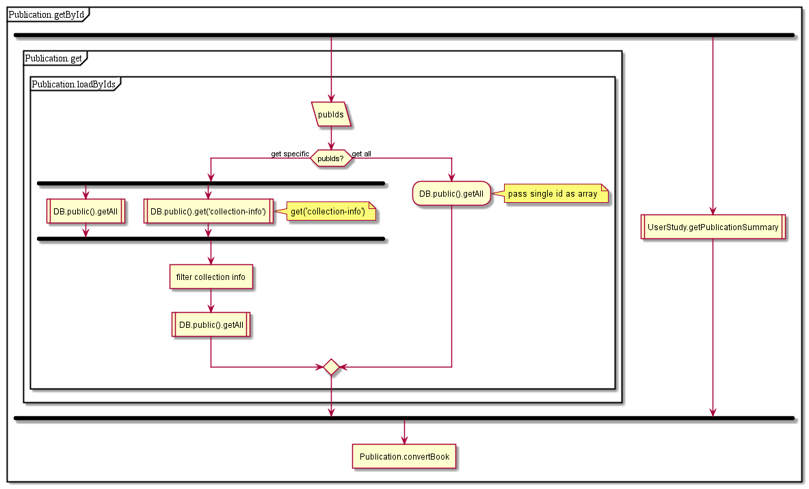
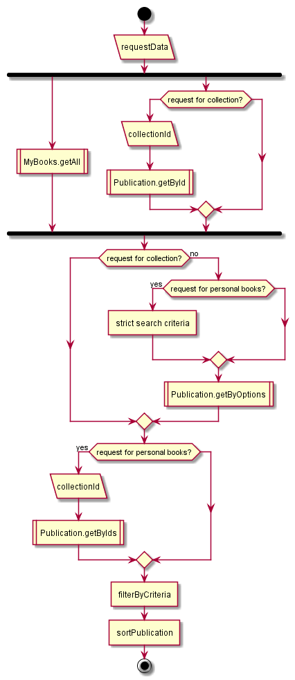
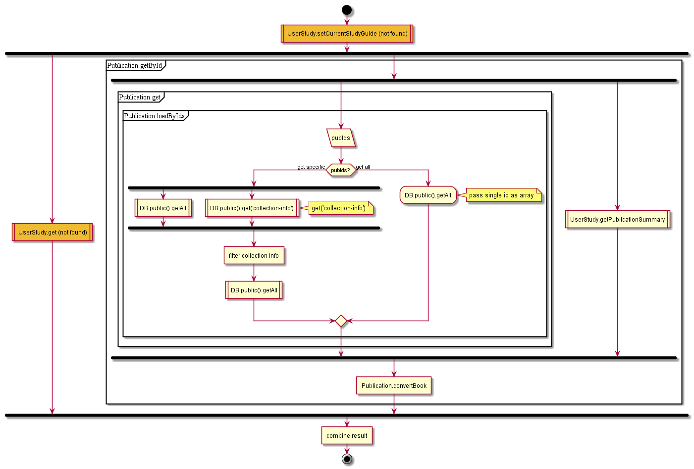
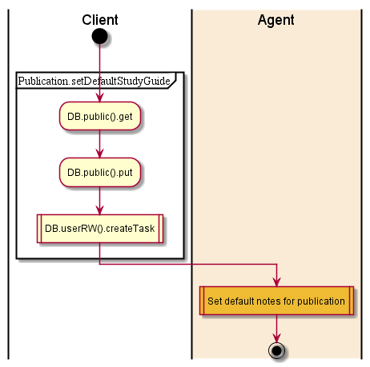

## Contents

* [Publication.GET.details](#publication-get-details)
* [Publication.GET.getBookInfo](#publication-get-getbookinfo)
* [Publication.GET.getCollectionInfo](#publication-get-getcollectioninfo)
* [Publication.GET.getStudyGuideInfo](#publication-get-getstudyguideinfo)
* [Publication.GET.search](#publication-get-search)
* [Publication.POST.persistCurrentStudyGuide](#publication-post-persistcurrentstudyguide)
* [Publication.POST.persistDefaultStudyGuide](#publication-post-persistdefaultstudyguide)

## Publication.GET.details

1. Get publication by ID (+summary)

  

## Publication.GET.getBookInfo

1. Get publication by ID
1. If studyguide - get original publication
1. Get related to publication books
1. Get activity
1. Get editors for studyguide
1. convert

  

## Publication.GET.getCollectionInfo

1. Get collection by ID
2. convert

  

## Publication.GET.getStudyGuideInfo

See [getBookInfo](#publication-get-getbookinfo)

## Publication.GET.search

GET search:
1. If collectionId is provided - get collection and return items
2. Get my books
3. Apply filter
4. Sort, slice

  

## Publication.POST.persistCurrentStudyGuide

1. See [POST persistDefaultStudyGuide](#publication-post-persistdefaultstudyguide)
2. Get user study
3. Get publication by ID
4. Convert data

  

## Publication.POST.persistDefaultStudyGuide

1. Get publication from public DB
2. Set guideId (local changes)
3. Create task ‘publication-guide’
4. Set default notes for publication

  

