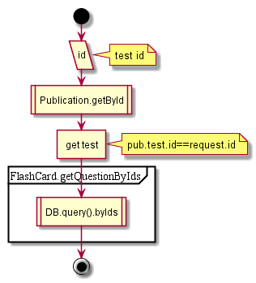

# ManageTests

## Contents

* [About](#about)
* [GET getTest](#get-gettest)

## About

See also [Publication.getById](../dao/Publication#getbyid) and [Publication.getByIds](../dao/Publication#getbyids)

## GET getTest

1. Get publication by ID
  1. get pub-ID and ~~activity for pub-ID~~
1. Find test in .test property
1. Request flashcards by .questions property from query DB (online call)
1. Return test with flashcards

  
