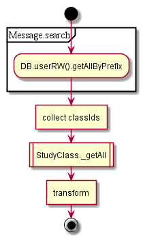

# PersonalMessage

## Contents

* [GET search](#get-search)
* [POST updatestate](#post-updatestate)

## GET search

1. see usernotification 1.2
2. Filter by IDs
3. Get courses by classIds
4. Set student/teacher status

  

## POST updatestate

1. Get messages by keys
1. Set reviewed param
1. Agent handler?

  
