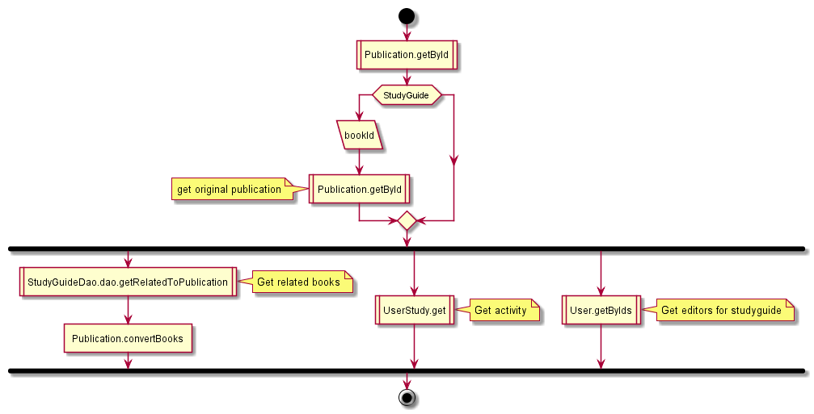
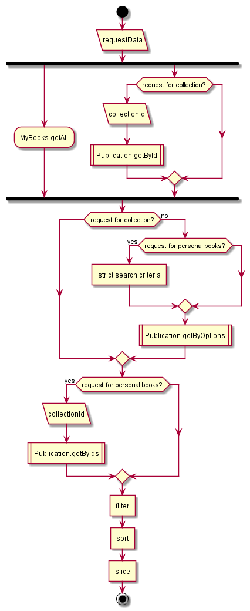
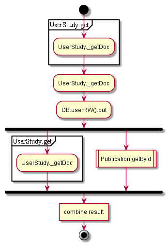
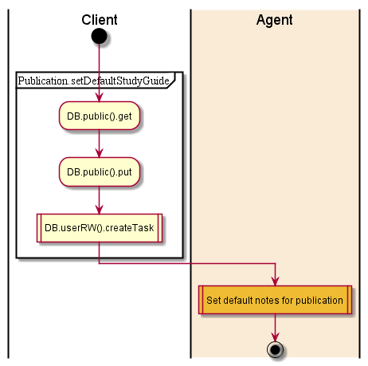

# Publications

## Contents

* [About](#about)
* [controller.publication GET getStudyGuideInfo](#controllerpublication-get-getstudyguideinfo)
* [GET details](#get-details)
* [GET getBookInfo](#get-getbookinfo)
* [GET getCollectionInfo](#get-getcollectioninfo)
* [GET search](#get-search)
* [POST persistCurrentStudyGuide](#post-persistcurrentstudyguide)
* [POST persistDefaultStudyGuide](#post-persistdefaultstudyguide)

## About

These items are related to mostly all endpoints:

* [Publication.getById](../dao/Publication.md#getbyid)
* [Publication.getByIds](../dao/Publication.md#getbyids)
* [Publication.getByOptions](../dao/Publication.md#getbyoptions)

## controller.publication GET getStudyGuideInfo

See [getBookInfo](#publicationgetgetbookinfo)

## GET details

1. Get publication by ID (+summary)

  

## GET getBookInfo

1. Get publication by ID
1. If studyguide - get original publication
1. Get related to publication books
1. Get activity
1. Get editors for studyguide
1. convert

  

## GET getCollectionInfo

1. Get collection by ID
2. convert

  

## GET search

GET search:

1. If collectionId is provided - get collection and return items
2. Get my books
3. Apply filter
4. Sort, slice

  

## POST persistCurrentStudyGuide

1. See [POST persistDefaultStudyGuide](#publication-post-persistdefaultstudyguide)
2. Get user study
3. Get publication by ID
4. Convert data

  

## POST persistDefaultStudyGuide

1. Get publication from public DB
2. Set guideId (local changes)
3. Create task ‘publication-guide’
4. Set default notes for publication

  
