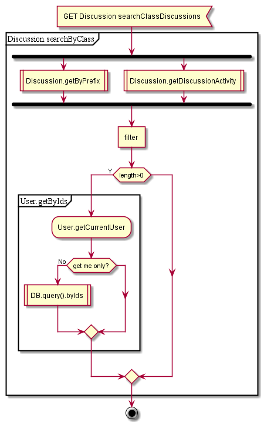
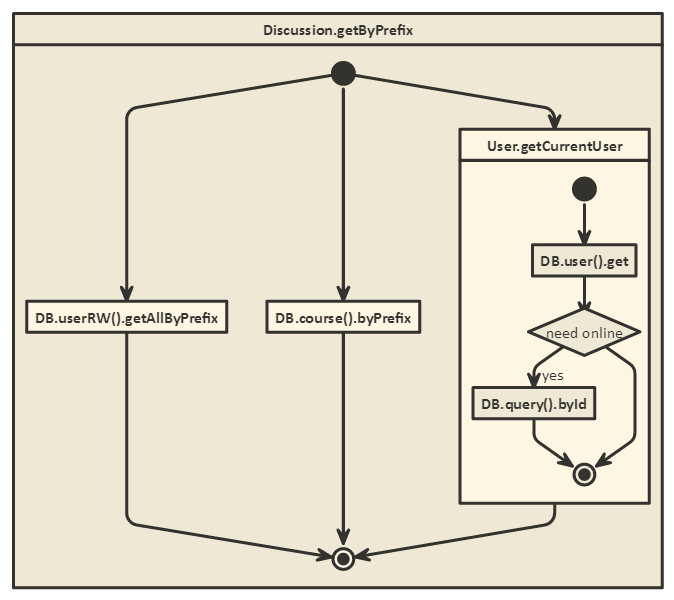
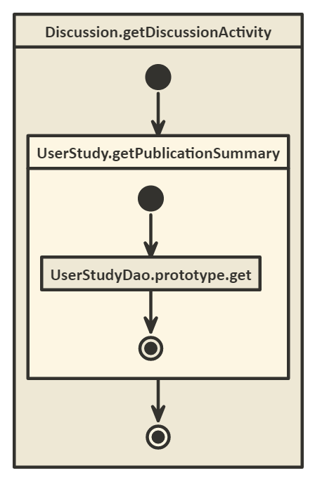

## Discussion controller

GET searchClassDiscussions:
Get discussions by class and publication ID
1.1) get by prefix (‘discussion’)
    1.1.1) get from userRW
    1.1.2) get from course DB (online call)
    1.1.3) get current user  //DB.userId()
    1.1.4) concat and filter (uniq)
1.2) get discussion activity
    1.2.1) get activity for course
    1.2.2) get .discussion value

Filter discussions by class, inject messages
Get info about users (message authors) and add firstName, lastName, photo to message

