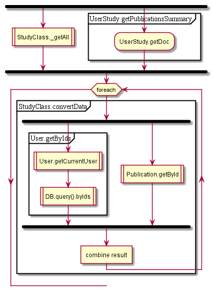

# StudyClass

## Contents

* [_getAll](#_getall)
* [getByIds](#getbyids)

## _getAll

  

## getByIds

See also [ublication.getById](../Publication.md#getbyid) and [tudyClass._getAll](../StudyClass.md#_getall)

  
