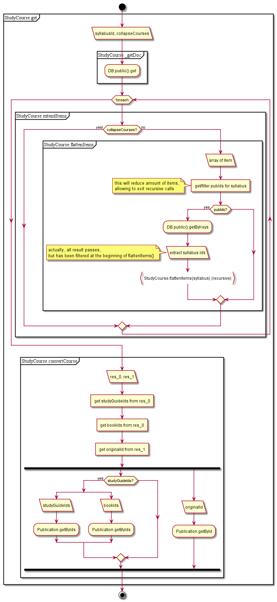

# StudyCourses

## GET get

1. Get doc from public DB
2. Expand nested items
  1. get IDs from items
  1. get publications by IDs
  1. convert items
3. Convert syllabus
  1. get all books if presented
  1. get all studyguides if presented
  1. ~~get publication by ID~~
    1. ~~get syllabus (again), summary and convert~~ //just use converter, if required

  
