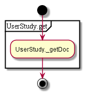
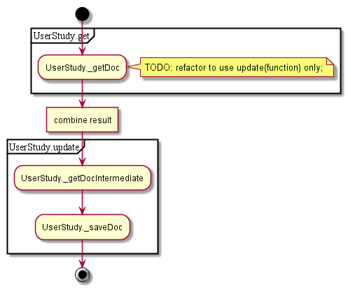

# UserStudy

## Contents

* [controller.userStudy POST persistprogress](#controlleruserstudy-post-persistprogress)
* [GET activityByItem](#get-activitybyitem)
* [POST initiate](#post-initiate)
* [POST persistEssay](#post-persistessay)
* [POST persistParagraphSummary](#post-persistparagraphsummary)
* [POST persistTest](#post-persisttest)
* [POST readingprogresstracking](#post-readingprogresstracking)
* [POST searchuserstudy](#post-searchuserstudy)

## controller.userStudy POST persistprogress

Client:

1. Save activity data
1. If book reading completed - add to my books

Agent:

1. Add activity to allActivity doc in user query DB
1. Iterate over activity for classes, get course DB (loop)
1. If .readingDuration wasn’t changed - skip
1. Clean unused info and leave progress for last 7 days only

  

## GET activityByItem

1. Get activity by ID

  

## POST initiate

1. If publication mode - get activity and convert
1. If class mode
  1. get activity for class and ~~publication by ID  (+summary)~~
  1. if publication type is syllabus - get items from it
2. Fill in progress and convert

  

## POST persistEssay

1. Get publication by ID
1. If type is syllabus, find appropriate item
1. If type is study guide - get original publication
1. Find essay task in publication
1. Get activity and update
1. ~~Handle activity change~~

  

## POST persistParagraphSummary

1. Update activity
1. ~~Handle activity change~~

  

## POST persistTest

1. Update activity
1. ~~Handle activity change~~

  

## POST readingprogresstracking

1. Update activity
1. ~~Handle activity change~~

  

## POST searchuserstudy

1. Get class by ID
1. Get activity for users
  1. filter user IDs
  1. get activities for users from course DB (online call)
1. Get info about users
  1. ~~get current user(+-online call)~~
  1. if it’s the same user - return result
  1. get data from query DB by keys
1. convert

  
