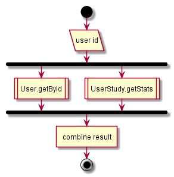
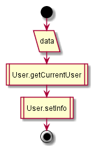

# Users

## Contents

* [GET profile](#get-profile)
* [POST update](#post-update)

## GET profile

1. Get user and stats
  1. get current user
    1. get doc ‘login-info’ from user query DB
    1. if .updated value great than 1 hour, send online request to query DB
    1. update doc
  1. get activity doc
    1. convert
2. Convert data

  

## POST update

1. Get current user (see GET profile 1.1.)
1. Update 'firstName', 'lastName', 'email', 'photo' fields
1. Update doc
1. ~~Call existing API~~ //TODO create task for this operation

  
