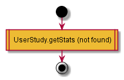
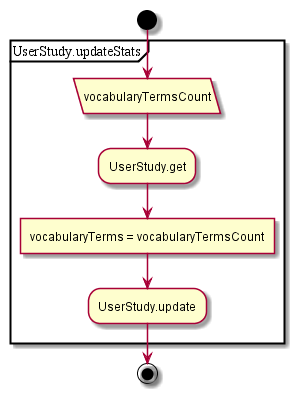

# Vocabulary

## Contents

* [GET vocabularyResults](#get-vocabularyresults)
* [POST saveVocabulary](#post-savevocabulary)

## GET vocabularyResults

1. Get activity, convert

  

## POST saveVocabulary

1. Get activity
1. Update vocabulary terms count value
1. Save doc
1. ~~Handle activity change //agent~~

  
