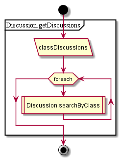
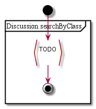
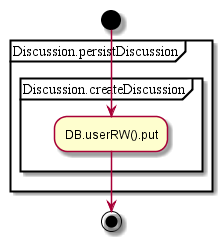
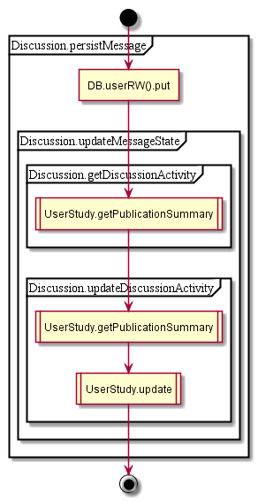

# Discussion

## Contents

* [GET getClassDiscussion](#get-getclassdiscussion)
* [GET searchClassDiscussions](#get-searchclassdiscussions)
* [POST persistClassDiscussion](#post-persistclassdiscussion)
* [POST persistDiscussionMessage](#post-persistdiscussionmessage)

## GET getClassDiscussion

Get discussion for class

1. call searchClassDiscussions (described above)
  1. Filter by class

  

## GET searchClassDiscussions

Get discussions by class and publication ID

1. get by prefix (‘discussion’)
  1. get from userRW
  1. get from course DB (online call)
  1. ~~get current user~~ //DB.userId()
  1. concat and filter (uniq)
2. get discussion activity
  1. get activity for course
  1. get discussion value

  

## POST persistClassDiscussion

Get discussion for class
1. call searchClassDiscussions (described above)
  1. Filter by class

  

## POST persistDiscussionMessage

Client part:

1. Insert data to user RW
2. Set informed, reviewed params (mb skip, assume that all author messages are reviewed)
  1. get activity by class
  2. update .discussion
3. Update activity (see updateUserDiscussionMessagesState 4.)
4. Return ‘Ok’ (important!)

Agent part:

1. Get course DB by classId
2. If DB does not exist - reject Promise, otherwise - get doc from course DB
3. Update values and upsert doc in course DB
4. Remove doc from userRW DB

  

