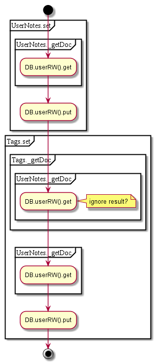

# Materials

## Contents

* [GET annotations](#get-annotations)
* [GET categories](#get-categories)
* [POST update](#post-update)


## GET annotations

Get user materials

1. get publication ID
  1. ~~get publication by ID~~
  1. if StudyGuide - return book ID that is based on that StudyGuide, otherwise - book ID
1. Get user notes by publication and class ID
2. get notes from user RW

  


## GET categories

_offline flow only_

  


## POST update

Set tags and annotations (user only)
1. set tags, if specified (req.materials.categories)
  1. get tags doc
  1. update data
1. set annotations, if specified (req.materials.annotations)
  1. get usernotes doc for pub+class
  1. update data

#### Request
```json
{
 "bookId":"db5d14e1eeacc897ad5c6c955ee8b646",
 "editor":false,
 "studyGuide":false,
 "materials":{
     "annotations": [...]
 }
}

```

  
