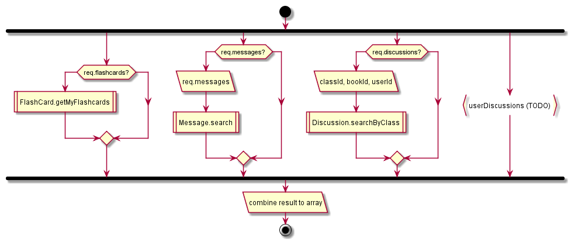

# Notification

## Contents

* [POST usernotification](#post-usernotification)

## POST usernotification

*NOTE* This method is executed every minute

1. get flashcards, messages, discussions, userDiscussions (not implemented o_O)
  1. get flashcards
    1. get flashcards doc from user RW
    2. get .values
    3. filter by time
  1. get messages
    1. get all messages by prefix (‘message’) from user RW
    1. filter by request params (reviewed)
    1. convert and return
  1. get discussions (unused userId param)
    1. call searchClassDiscussions (described above)
2. Collect all results

  

