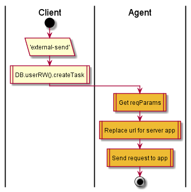

# Reports

## Contents

* [POST /](#post--)

## POST /

Send report about mistake

Client:

1. Post task with type ‘external-send’

Agent:

2. Get reqParams
3. Replace url for server app
4. Send request to app

  

