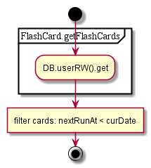

# StudyFlashcards

## Contents

* [GET all](#get-all)
* [GET searchAssignedFlashcards](#get-searchassignedflashcards)
* [GET searchStudies](#get-searchstudies)
* [POST activate](#post-activate)
* [POST add](#post-add)
* [POST initiate](#post-initiate)
* [POST update](#post-update)

## GET all

1. Get flashcards (‘flashcards’)

  

## GET searchAssignedFlashcards

1. Get all flashcards (‘flashcards’)
2. Initiate study
  1. get questions by IDs from query DB (online call)
  2. ~~get all flashcards (reuse result from 1.)~~
1. Filter and convert

  

## GET searchStudies

1. get flashcards doc from user RW
1. get .values
1. filter by time

  

## POST activate

1. Get publication by ID //TODO use raw call instead
1. Find test info
1. Generate cards from test questions
1. Get all flashcards
1. Add new cards to doc
1. Update

  

## POST add

1. Get all flashcards
1. Filter by term name
1. Check that flashcard was added already
1. Add study
  1. ~~get all flashcards~~
  1. set card
  1. update doc

  

## POST initiate

1. Initiate study
  1. get questions by IDs from query DB (online call)
  1. get all flashcards

  

## POST update

1. Get study by ID
  1. ~~get all flashcards~~
  1. find appropriate
2. Update current study
  2. ~~get all flashcards~~
  2. find study
  2. update value
  2. ~~get all flashcards~~
  2. update doc

  
