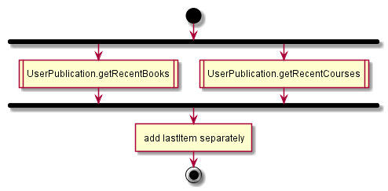
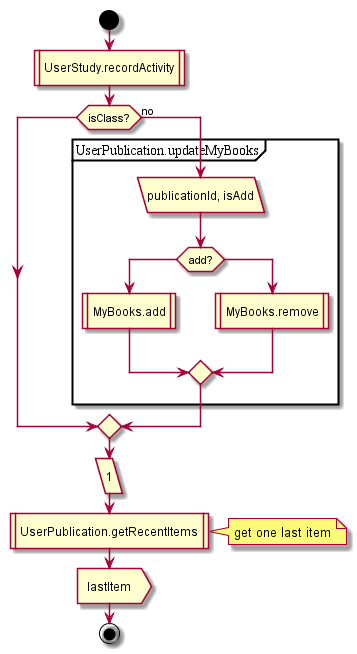

# UserPublication

## Contents

* [GET getRecentBooks](#get-getrecentbooks)
* [POST update](#post-update)

## GET getRecentBooks

1. get recent books
  1. get activity doc, sort keys by lastOpenedAt value, slice
  1. get publications by IDs
    1. get summary (from activity)
  1. convert data
  1. get publication by ID for studyguide and replace name, author, cover
2. get recent courses
  2. ~~the same as 3.1.1~~
  2. get courses by IDs
    2. get by IDs from query and userRW DBs, merge results
    2. get summary
    2. convert
  2. sort
3. set last item

  

## POST update

Client:

1. Update activity
1. If in reader mode (not in class) - update my books list
1. ~~Get recent items for 1 item~~ see [getRecentBooks](#get-getrecentbooks)

Agent:

1. Handle activity change

  

