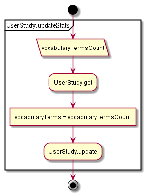
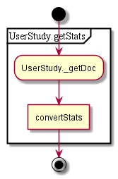

# Vocabulary

## Contents

* [GET saveVocabulary](#get-savevocabulary)
* [GET vocabularyResults](#get-vocabularyresults)

## GET saveVocabulary

1. Get activity
1. Update vocabulary terms count value
1. Save doc
1. ~~Handle activity change //agent~~

  

## GET vocabularyResults

1. Get activity, convert

  

